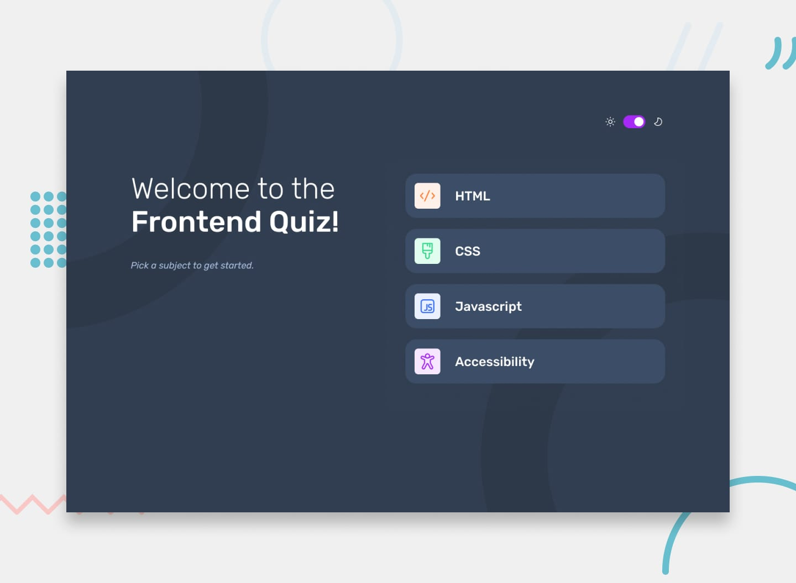

# Frontend Mentor - Frontend quiz app solution

This is a solution to the [Frontend quiz app challenge on Frontend Mentor](https://www.frontendmentor.io/challenges/frontend-quiz-app-BE7xkzXQnU). Frontend Mentor challenges help you improve your coding skills by building realistic projects. 

## Table of contents

- [Overview](#overview)
  - [The challenge](#the-challenge)
  - [Screenshot](#screenshot)
  - [Links](#links)
- [My process](#my-process)
  - [Built with](#built-with)
  - [What I learned](#what-i-learned)
  - [Continued development](#continued-development)
- [Author](#author)
- [Acknowledgments](#acknowledgments)

## Overview

### The challenge

Users should be able to:

- Select a quiz subject
- Select a single answer from each question from a choice of four
- See an error message when trying to submit an answer without making a selection
- See if they have made a correct or incorrect choice when they submit an answer
- Move on to the next question after seeing the question result
- See a completed state with the score after the final question
- Play again to choose another subject
- View the optimal layout for the interface depending on their device's screen size
- See hover and focus states for all interactive elements on the page
- Navigate the entire app only using their keyboard
- **Bonus**: Change the app's theme between light and dark

### Screenshot

### Links

- Solution URL: [https://github.com/AcharaChisomSolomon/frontend-quiz-app](https://github.com/AcharaChisomSolomon/frontend-quiz-app)
- Live Site URL: [https://achchi-frontend-quiz-app.netlify.app/](https://achchi-frontend-quiz-app.netlify.app/)

## My process

### Built with

- Semantic HTML5 markup
- CSS custom properties
- Flexbox
- Mobile-first workflow
- JavaScript
- [React](https://reactjs.org/) - JS library

### What I learned

My main takeaway from this project is the use of conditional rendering and state management.

### Continued development

I ultimately want to make this a full stack project.

## Author

- Website - [Achara Chisom Solomon](https://twitter.com/Chisom14Solomon)
- Frontend Mentor - [@AcharaChisomSolomon](https://www.frontendmentor.io/profile/AcharaChisomSolomon)
- Twitter - [@Chisom14Solomon](https://twitter.com/Chisom14Solomon)

## Acknowledgments

Thanks to [@kentcdodds](https://twitter.com/kentcdodds) and [@JoshWComeau](https://twitter.com/joshwcomeau) for their amazing React and CSS courses respectively.